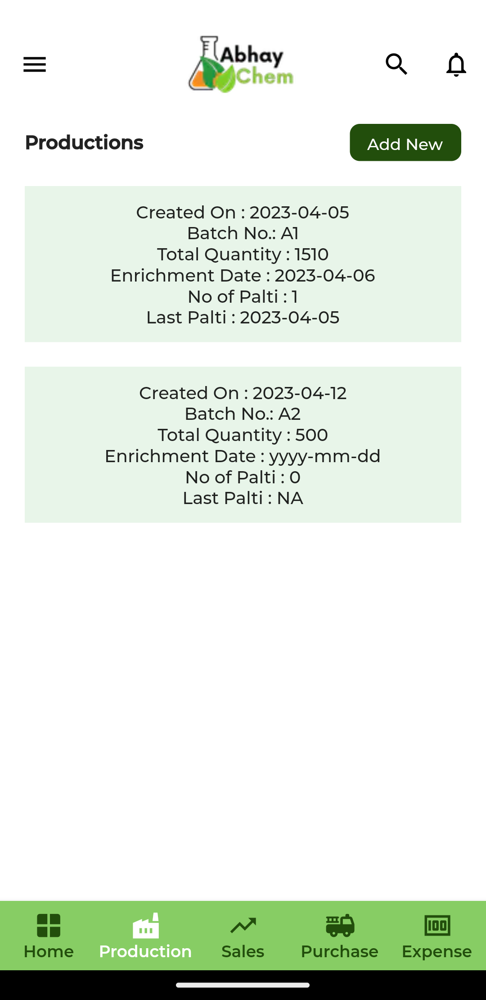

# abhay_chemicals

## Screens

### Splash Screen

At this stage firebase user status will be checked and accordingly will be navigated to login or home screen
  

  

### Login Screen

login screen only for admin, with link for password reset page

 

  

### Botton Navigation Menu

This is the demo menu as of now, yet to decide which menu keep in bottom and which in sidebar
 

### Sidebar Menu (Updated)

This is the initial look and still under changes. all possible app navigation will be here except search and notification page
 

### Production Page

Initial layout of production page, will add some more styling after completeing other firestore integrations
 

### Currently working on

Bottom Navigation for quick navigation to mostly used screens
Sidebar navigation for overall app routing..

TODO:

#### Production

View Productions - Done
Delet Production - Done
View Production Detail - Done
Add Production - Done
Edit Production - Done

#### Sales

View Sales - Done
Delet Sale - Done
View Sale Details - Pending
Add Sale of an Order - Done
Add Direct Sale - Pending
Edit Sale - Pending

#### Order

View Order Details - Done
Delet Order - Done
View Orders - Done
Edit Order - Pending
Add Order - Pending

#### Purchase

View Purchase - Done
Delet Purchase - Done
View Purchase Detail - Done
Add Purchase - Pending
Edit Purchase - Pending

#### Expense

View Purchase - Done
Delet Expense - Done
View Expense Detail - Done
Add Expense - Done
Edit Expense - Done

#### Customer

View Customer - Done
Delet Customer - Done
View Customer Detail - Done
Add Customer - Done
Edit Customer - Done

#### Supplier

View Supplier - Done
Delet Supplier - Done
View Supplier Detail - Done
Add Supplier - Done
Edit Supplier - Done

#### User/Admin

Add User/Admin - Done
Delet User/Admin - Done
Edit User/Admin - Done
Reset Password - Done

#### Careof

Add Careof - Done
Delet Careof - Done
Edit Careof - Done
